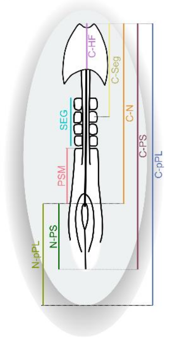

```{r setup, include = FALSE}
#knitr::opts_knit$set(root.dir = here::here())
knitr::opts_chunk$set(
  echo = TRUE,
  collapse = TRUE,
  comment = '#>',
  message = FALSE,
  warning = FALSE,
  out.width = '100%',
  fig.width = 12,
  fig.height = 6
)

```

## Analysis of Pairwise Overlap Between HH Stages

Embryo measurements | Schematic representation of the measurements taken

```{r embryo_measures, echo=FALSE, out.width='20%', fig.width=6, fig.height=3}


```


### 1. Import and tidy the data 

```{r tidy, warning=FALSE, message=FALSE, cache=FALSE}

# Load libraries
library(tidyverse)
library(here)
library(ggridges)  # for ridge plot visualization
library(reshape2)  # to use melt()
library(patchwork) # to combine plots with wrap_plots()

#
## Import raw data
#
raw_embryo_length <-
  readr::read_delim(
    file = here::here("chick_elong_overlap/data_embryo_elongation/input/ChickElongQuant_input.csv"),
    delim = ",",
    na = "",
    escape_double = FALSE,
    trim_ws = TRUE, 
    locale = locale(decimal_mark = ".") # Important | To deal with the fact that in Portugal, sometimes, the decimals are commas.
  )

#
## Format the dataset
#

# Vector with the HH stages ordered 
hh_levels_order <- c("HH4","HH5","HH6","HH7","HH8","HH9","HH10")
nr_of_embryos <- length(unique(raw_embryo_length$Embryo))

# Wide format
clean_embryo_length <- 
  raw_embryo_length |>
  dplyr::select(-NumberMeasuredFrames, -CultureType) |>
  dplyr::filter(!is.na(HHStage)) |>
  dplyr::mutate(HHStage = paste0("HH", HHStage),
                HHStage = factor(HHStage, levels = hh_levels_order),
                Embryo = factor(Embryo, levels = 1:nr_of_embryos)) |>
  dplyr::relocate(c(Embryo, HHStage), .before = Time)


# Pivot the data to long format for plotting
clean_embryo_length_longer <-
  clean_embryo_length |>
  tidyr::pivot_longer(
    cols = !c(Embryo, HHStage, Time),
    names_to = "Measure",
    values_to = "Length_mm"
  )


# Measurements description (for plots)
measurements <- tibble::tibble(
  measure = c(
    "1.Total embryo length (mm)",
    "2.Total PS length (mm)",
    "3.Notochord length (mm)",
    "4.Posterior length (mm)",
    "5.PS length (mm)",
    "6.PSM length (mm)",
    "7.Anterior length (mm)",
    "8.Segmented length (mm)",
    "9.Head fold length (mm)"
  ),
  acronym = c(
    "C-pPL",
    "C-PS",
    "C-N",
    "N-pPL",
    "N-PS",
    "PSM",
    "C-Seg",
    "SEG",
    "C-HF"
  ),
  my_labs = c(
    "C-pPL | Total embryo length",
    "C-PS | Total Primitive Streak length",
    "C-N | Notochord length",
    "N-pPL | Posterior region length",
    "N-PS | Primitive Streak length",
    "PSM | Presomitic Mesoderm length",
    "C-Seg | Anterior region length",
    "SEG | Segmented region length",
    "C-HF | Head fold length"
  )
)

```

### 2. Overview of measurements taken

```{r overview, message=FALSE, warning=FALSE, eval=TRUE, cache=FALSE}

## Summary stats
summary(clean_embryo_length)

## Look at the Number of embryos per HH stage
clean_embryo_length |>
  # Reverse the order of the stacks (from bottom to top)
  dplyr::mutate(HHStage = factor(HHStage, levels = rev(unique(HHStage)))) |>
  dplyr::count(Embryo, HHStage) |>
  ggplot(aes(x = Embryo, y = n, fill = HHStage)) + 
  geom_col() +
  ylab("Number of measures taken per HH Stage") +
  ggtitle("Number of Measures per HHStage in Each Embryo") +
  geom_text(aes(label = n), position = position_stack(vjust = 0.5), 
            color = "black", size = 3.5) +
  theme_minimal() 

```

### 3. Ridge plots | Per time and Faceted by measure

```{r ridge_plots, message=FALSE, warning=FALSE, eval=TRUE, cache=FALSE, fig.height=10}

## Ridge plots | Per Time
plot_time <-
  clean_embryo_length_longer |>
  ggplot(mapping = aes(x = Time, y =HHStage, fill = HHStage)) +
  geom_density_ridges(
    alpha = 0.75,
    rel_min_height = 0.001,
    scale = 1,
    quantile_lines = TRUE,
    quantiles = 2,
    jittered_points = TRUE,
    position = "points_sina",
    point_alpha = 0.6,
    point_size = 0.5
  ) +
  theme_ridges(grid = TRUE, center_axis_labels = TRUE) +
  theme(legend.position = "none") +
  #xlim(c(0, 7.1)) +
  #scale_x_continuous(breaks = seq(0, 8, 1)) +
  xlab("Time (min)") +
  ylab('HH stage') +
  ggtitle("Embryo time distribution per HH stage")

print(plot_time)


# Ridge plots | Faceted per measure
ggplot(clean_embryo_length_longer, aes(x = Length_mm, y = HHStage, fill = HHStage)) +
  ggridges::geom_density_ridges(
    alpha = 0.75,
    rel_min_height = 0.001,
    scale = 2,
    quantile_lines = TRUE,
    quantiles = 2,
    jittered_points = TRUE,
    position = "points_sina",
    point_alpha = 0.8,
    point_size = 0.5
  ) +
  theme_ridges(grid = TRUE, center_axis_labels = TRUE) +
  facet_wrap(~Measure, scales = "free_x") +
  theme(legend.position = "none") +
  labs(
    title = "Embryo Measurement Distributions per HH Stage",
    x = "Measurement Value",
    y = "HH Stage"
  ) 

```

### 4. Ridge plots | Per measure

```{r ridge_individual}

# Ridge plots | Individual plots per measure
for (my_measure in measurements$acronym) {
  plot_data <- clean_embryo_length_longer |>
    dplyr::filter(Measure == my_measure) |>
    drop_na(Length_mm)
  
  p <- ggplot(plot_data, aes(x = Length_mm, y = HHStage, fill = HHStage)) +
    geom_density_ridges(
      alpha = 0.75,
      rel_min_height = 0.001,
      scale = 2,
      quantile_lines = TRUE,
      quantiles = 2,
      jittered_points = TRUE,
      position = "points_sina",
      point_alpha = 0.8
    ) +
    scale_fill_manual(values = scales::hue_pal()(7), limits = levels(clean_embryo_length_longer$HHStage)) +
    theme_ridges(grid = TRUE, center_axis_labels = TRUE) +
    theme(legend.position = "none") +
    labs(
      title = paste("Distribution of", my_measure, "by HH Stage"),
      x = paste(my_measure, "(mm)"),
      y = "HH Stage"
    )
  
  print(p)
}

```


### 5. Functions to calculate overlap

**Goal:** Calculate the pairwise overlap between measurement distributions.

**Overview of the approach**

The idea is to calculate the integral of the minimum of the two density functions over the range where both have nonzero density. This provides a straightforward measure of similarity between two distributions, and therefore an intuitive way to quantify the overlap between the ridge plots (or kernel density estimates).

**Simple Overlap Calculation**

  1. Estimate Kernel Density: Compute the density estimates for both distributions using the same grid of points.
  2. Find the Intersection: At each grid point, take the minimum value of the two density functions.
  3. Integrate the Intersection: Sum (or integrate) these minimum density values across the grid to obtain the overlap score.

Mathematically:

  `Overlap = ∫ min(f1(x), f2(x)) dx`

where f1(x) and f2(x) are the density functions of the two distributions.

**Why This Works**

  1. The approach is scale-invariant (not affected by total number of observations).
  2. It gives an intuitive measure where 0 means no overlap and 1 means complete overlap (if densities are normalized).
  3. It does not require complex statistics, just basic density estimation and summation.


```{r distrib_overlap_functions2, eval=FALSE}

# Function to compute overlap between two distributions
calculate_overlap <- function(x1, x2, bw = "SJ", n = 512) {
  d1 <- density(x1, bw = bw, n = n)
  d2 <- density(x2, bw = bw, n = n)
  
  # Find common range where densities are nonzero
  lower_bound <- max(min(d1$x), min(d2$x))
  upper_bound <- min(max(d1$x), max(d2$x))
  
  # If there is no overlap, return 0
  if (lower_bound >= upper_bound) return(0)
  
  # Define the function for the minimum of two densities
  min_density_function <- function(x) {
    f1 <- approx(d1$x, d1$y, xout = x, rule = 2)$y
    f2 <- approx(d2$x, d2$y, xout = x, rule = 2)$y
    pmin(f1, f2)
  }
  
  # Compute the integral over the overlapping range
  overlap_value <- integrate(min_density_function, lower = lower_bound, upper = upper_bound)$value
  
  return(overlap_value)
}

# Function to compute pairwise overlaps and generate plots
calculate_pairwise_overlap <- function(data_list, my_name, bw = "SJ", n = 512) {
  
  names_list <- str_sort(names(data_list), numeric = TRUE)
  if (is.null(names_list)) names_list <- paste0("D", seq_along(data_list))
  
  n_datasets <- length(data_list)
  overlap_matrix <- matrix(0, nrow = n_datasets, ncol = n_datasets, dimnames = list(names_list, names_list))
  
  for (i in seq_len(n_datasets)) {
    for (j in seq_len(n_datasets)) {
      if (i <= j) {
        overlap_matrix[i, j] <- calculate_overlap(data_list[[i]], data_list[[j]], bw = bw, n = n)
        overlap_matrix[j, i] <- overlap_matrix[i, j] # Symmetric matrix
      }
    }
  }
  
  #
  # Plots
  #
  
  # Convert matrix to long format for ggplot
  overlap_df <- reshape2::melt(overlap_matrix)
  colnames(overlap_df) <- c("Distribution1", "Distribution2", "Overlap")
  
  # Heatmap plot
  heatmap_plot <-
    overlap_df |>
    filter(as.integer(Distribution2) <= as.integer(Distribution1)) |>
    ggplot(aes(x = Distribution1, y = Distribution2, fill = Overlap)) +
    geom_tile() +
    geom_text(aes(label = round(Overlap, 3)), color = "grey25", size = 5) +
    scale_fill_gradient(low = "white", high = "salmon") +
    theme_minimal() +
    labs(title = paste(my_name, "| Density Overlap"), fill = "Overlap") +
    theme(axis.text.x = element_text(angle = 45, hjust = 1))
  
  # Convert list to long format for ridge plot
  ridge_df <- do.call(rbind, lapply(names_list, function(name) {
    data.frame(Value = data_list[[name]], Distribution = name)
  }))
  
  # Convert Distribution to a factor with numerically ordered levels
  ridge_df$Distribution <- factor(ridge_df$Distribution, levels = names_list)

  # Ridge plot
  ridge_plot <- ggplot(ridge_df, aes(x = Value, y = Distribution, fill = Distribution)) +
    geom_density_ridges(alpha=0.75, rel_min_height = 0.001, scale = 1,
                        quantile_lines = TRUE, quantiles=2,
                        jittered_points = TRUE, position = "points_sina",
                        point_alpha = 0.7, point_size = 1, point_shape = 20) +
    scale_fill_manual(values = scales::hue_pal()(7), limits = levels(clean_embryo_length_longer$HHStage)) +
    theme_minimal() +
    #scale_fill_brewer(palette = "Set3") +
    labs(title = measurements[which(measurements$acronym == my_name), ]$my_labs, 
         x = "Length (mm)", 
         y = "HH Stage") +
    theme(legend.position = "none")
  
  # Return both plots as a list
  # return(list(ridge_plot = ridge_plot, heatmap = heatmap_plot, overlap_matrix = overlap_matrix))
  return(list(ridge_plot = ridge_plot, heatmap = heatmap_plot))

}

```


```{r distrib_overlap_functions}
#
# Function to compute overlap between two distributions
#
calculate_overlap <- function(x1, x2, bw = "SJ", n = 512) {
  d1 <- density(x1, bw = bw, n = n)
  d2 <- density(x2, bw = bw, n = n)
  
  # Find common range where densities are nonzero
  lower_bound <- max(min(d1$x), min(d2$x))
  upper_bound <- min(max(d1$x), max(d2$x))
  
  # If there is no overlap, return 0
  if (lower_bound >= upper_bound) return(0)
  
  # Define the function for the minimum of two densities
  min_density_function <- function(x) {
    f1 <- approx(d1$x, d1$y, xout = x, rule = 2)$y
    f2 <- approx(d2$x, d2$y, xout = x, rule = 2)$y
    pmin(f1, f2)
  }
  
  # Compute the integral over the overlapping range
  overlap_value <- integrate(min_density_function, lower = lower_bound, upper = upper_bound)$value
  
  return(overlap_value)
}

#
# Compute pairwise overlap matrix between named numeric vectors
#
calculate_pairwise_overlap_matrix <- function(data_list, bw = "SJ", n = 512) {
  names_list <- str_sort(names(data_list), numeric = TRUE)
  if (is.null(names_list)) names_list <- paste0("D", seq_along(data_list))
  
  n_datasets <- length(data_list)
  overlap_matrix <- matrix(0, nrow = n_datasets, ncol = n_datasets,
                           dimnames = list(names_list, names_list))
  
  for (i in seq_len(n_datasets)) {
    for (j in seq_len(n_datasets)) {
      if (i <= j) {
        overlap_matrix[i, j] <- calculate_overlap(data_list[[i]], data_list[[j]], bw = bw, n = n)
        overlap_matrix[j, i] <- overlap_matrix[i, j] # Symmetric
      }
    }
  }
  
  return(overlap_matrix)
}

#
# Plot heatmap and ridge plot of pairwise overlap results
#
plot_pairwise_overlap_results <- function(overlap_matrix, data_list, my_name,
                                          measurements = NULL, fill_levels = NULL) {
  names_list <- colnames(overlap_matrix)
  
  # Heatmap
  overlap_df <- reshape2::melt(overlap_matrix)
  colnames(overlap_df) <- c("Distribution1", "Distribution2", "Overlap")
  
  heatmap_plot <- overlap_df |>
    filter(as.integer(Distribution2) <= as.integer(Distribution1)) |>
    ggplot(aes(x = Distribution1, y = Distribution2, fill = Overlap)) +
    geom_tile() +
    geom_text(aes(label = round(Overlap, 3)), color = "grey25", size = 5) +
    scale_fill_gradient(low = "white", high = "salmon") +
    theme_minimal() +
    labs(title = paste(my_name, "| Density Overlap"), fill = "Overlap") +
    theme(axis.text.x = element_text(angle = 45, hjust = 1))
  
  # Ridge plot
  ridge_df <- do.call(rbind, lapply(names_list, function(name) {
    data.frame(Value = data_list[[name]], Distribution = name)
  }))
  
  ridge_df$Distribution <- factor(ridge_df$Distribution, levels = names_list)
  
  ridge_plot <- ggplot(ridge_df, aes(x = Value, y = Distribution, fill = Distribution)) +
    geom_density_ridges(
      alpha = 0.75, rel_min_height = 0.001, scale = 1,
      quantile_lines = TRUE, quantiles = 2,
      jittered_points = TRUE, position = "points_sina",
      point_alpha = 0.7, point_size = 1, point_shape = 20
    ) +
    theme_minimal() +
    labs(
      title = if (!is.null(measurements) && my_name %in% measurements$acronym) {
        measurements[which(measurements$acronym == my_name), "my_labs", drop = TRUE]
      } else {
        my_name
      },
      x = "Length (mm)", y = "HH Stage"
    ) +
    theme(legend.position = "none")
  
  if (!is.null(fill_levels)) {
    ridge_plot <- ridge_plot +
      scale_fill_manual(values = scales::hue_pal()(length(fill_levels)), limits = fill_levels)
  }

  return(list(ridge_plot = ridge_plot, heatmap = heatmap_plot))
}

```


### 6. Overlap plots | Length per HH Stage

```{r distrib_overlap_plots, eval=TRUE, message=FALSE, warning=FALSE}

# Format the input data as list 
clean_embryo_length_list <- clean_embryo_length |>
  select(-Time, -Embryo) |>
  pivot_longer(-HHStage, names_to = "Med", values_to = "Length") |>
  drop_na() |>
  group_by(Med, HHStage) |>
  summarise(Length = list(Length), .groups = "drop") |>
  nest(Length = c(HHStage, Length)) |>
  mutate(Length = map(Length, ~set_names(.x$Length, .x$HHStage))) |>
  deframe()


# Calculate the distribution overlap for all measurements
overlap_matrix <- setNames(
  lapply(clean_embryo_length_list, calculate_pairwise_overlap_matrix),
  names(clean_embryo_length_list)
)


# Plot results
combined_plots <- lapply(names(overlap_matrix), function(my_name) {
  
  # Access the input list and matrix
  data_list <- clean_embryo_length_list[[my_name]]
  matrix <- overlap_matrix[[my_name]]
  
  # Generate the plots
  plot_list <- plot_pairwise_overlap_results(
    overlap_matrix = matrix,
    data_list = data_list,
    my_name = my_name,
    measurements = measurements,  # optional if labels are used
    fill_levels = levels(clean_embryo_length_longer$HHStage)  # optional
  )
  
  # Combine into one view using patchwork
  patchwork::wrap_plots(plot_list, ncol = 2)
})

# Print the plots
combined_plots
```

### 7. Overlap plots | Time per HH Stage

```{r distrib_overlap_time, eval=FALSE, message=FALSE, warning=FALSE}

# Format the input data as list 
clean_time_list <- clean_embryo_length |>
  select(HHStage, Time) |>
  drop_na() |>
  group_by(HHStage) |>
  summarise(Time = list(Time), .groups = "drop") |> 
  tibble::deframe() |> 
  list(Time = _)


# Calculate the distribution overlap for time
overlap_plots_time <- calculate_pairwise_overlap(
  data_list = clean_time_list$Time,
  my_name = "Time"
)

# Print the plots
patchwork::wrap_plots(overlap_plots_time, ncol = 2) 

```
### 8. Session info and save RData

```{r save_rdata, eval=TRUE}

### Save the RData file ## Uncomment if needed
# save.image(file = here::here("chick_elong_overlap/data_embryo_elongation/embryo_elongation_analysis.RData"))

# Session info
sessionInfo()

```

